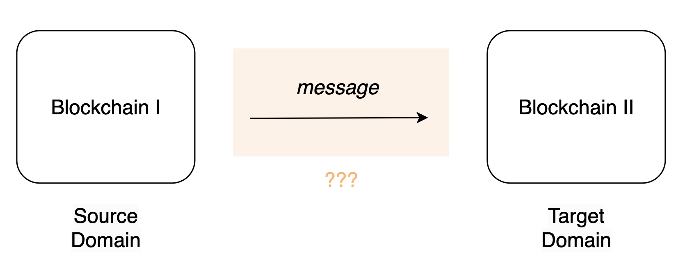
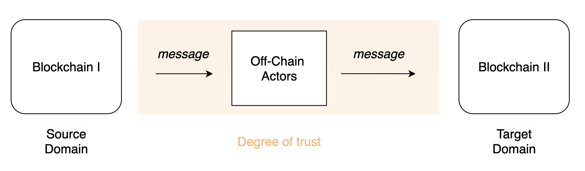
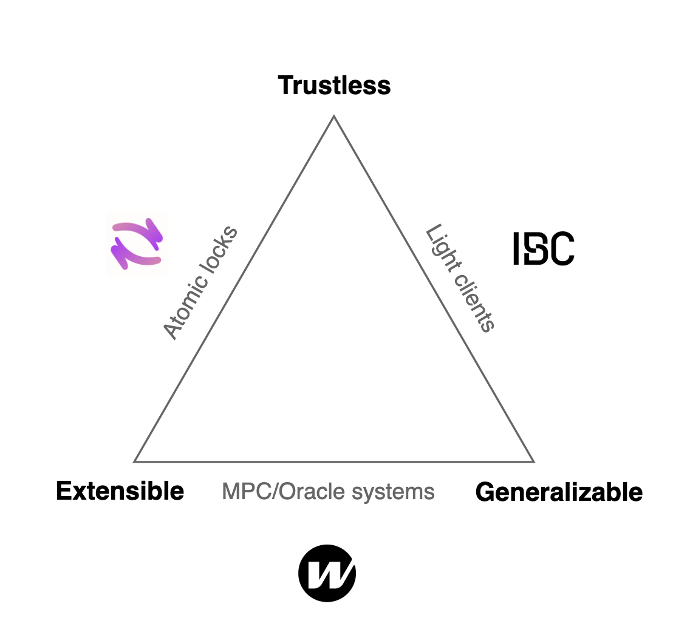
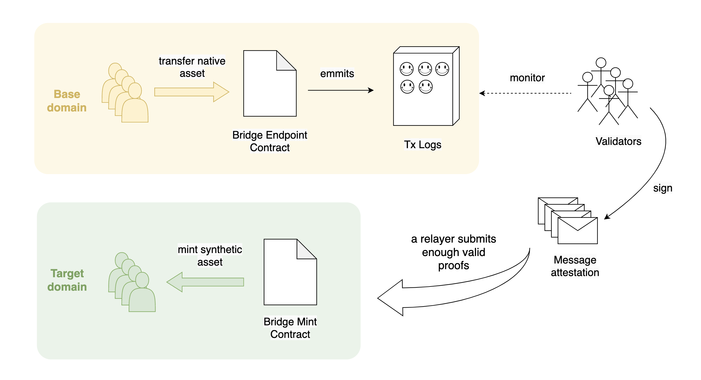

# Bridges

## Introduction

With the emerging landscape of new L1s around 2021/2022 and the more recent boom of L2s and L3s, blockchain bridges—and more broadly, interoperability protocols—have become just as important as the blockchains themselves. As [Vitalik stated](https://old.reddit.com/r/ethereum/comments/rwojtk/ama_we_are_the_efs_research_team_pt_7_07_january/hrngyk8/) three years ago, the future will be multi-chain, and the real challenge relies on understanding how these isolated environments can interact and communicate with each other.

As we know, the multi-chain web3 world is already a fact with [more than 250 chains](https://defillama.com/chains) (including L1s, L2s, sidechains, etc.), each of them with unique strengths, weaknesses, and priorities such as privacy, finality, thoughput, costliness, and the list continues. From [Arjun Bhuptani point of view](https://medium.com/everclear/introducing-everclear-the-first-clearing-layer-b8d6e1d78ca1), web3 has finally solved blockchain scalability but at the cost of widespread fragmentation of liquidity & user experience, and bridges are not enough to fix this. However, we will leave this conversation aside as it slightly overflows the scope of this document.

Early bridges started as an incipient (and sometimes naive) way to address interoperability by offering diverse ways for siloed blockchain environments to "connect" with each other. Bridges quickly became a critical component in web3 and many protocols had struggle, and still do, to address this challenge. This opened the door for the appearence of wrapped assets and the [wealthiest hacks](https://rekt.news/leaderboard/) and scams in the short cryptoeconomic history.

### The Brigde Problem

When discussing blockchains in the context of bridging and interoperability, we can refer to _domains_, each having different rules and consensus mechanisms (domains = chains & layers). In general, domains are unable to communicate with each other. With that said, we can pose the general problem that bridges aim to solve: **How can a message be sent from one domain to another, and how can the target domain verify the integrity and correctness of the message?**

The necessity of involving off-chain actors that, at least, relay the message becomes inevitable[^1]. The tasks and responsabilities assigned to these actors define the degree of trust that the bridge users' must assume.

There is obviously no one-way of solving this problem: bridges have different designs with unique strengths and trade-offs. The next section aims to showcase the bridge variety and its approaches to decentralization, trust and security matters.

## Analysis

This section analyzes and [compares](#comparison) three bridges upon: security, decentralization & trust assumptions[^ta]. The bridges were selected by pondering [7-day transacted volume](https://defillama.com/bridges)[^3], protocol diversity and the availability of quality documentation. Lastly, the bridges are positioned within the [Interoperability Trilemma](#the-interoperability-trilemma) triangle.

### Wormhole

[Wormhole](https://wormhole.com/) is a generic message-passing protocol between blockchains, consisting of two main components:

- A P2P network governed by 19 Guardians.
- A Wormhole "Core Contract" on each supported blockchain, with satellite protocol contracts.

When users initiate cross-chain transactions, core contracts emit messages (transaction logs) on source chains, which are listened by the Guardians. The Guardians are responsible for verifying and signing these messages. The signed messages are then relayed to the core contract on the destination chain. If more than two-thirds (2/3+) of the Guardians attest to the validity of a message, it is deemed valid, and the cross-chain transaction is executed on the destination chain.

The P2P Guardians network acts as Wormhole's oracle by monitoring on-chain activity and producing signed messages attestations for specific events. Every Guardian runs full nodes for every supported blockchain.

Guardians consensus:

- The super majority (any 2/3+ quorum) can pass arbitraty messages and governance decisions such as contract upgrades.
- The super minority (any 1/3+ quorum) can censor messages or governance decisions.

If guardians do not behave honestly:

- Users can be censored if 1/3+ of Guardians decide to stop processing certain transactions.
- Funds can be stolen if 2/3+ Guardians collude to sign fraudulent messages allowing to:
  - Mint more wrapped tokens than the ones locked in the native chain.
  - Allow the withdrawal of the locked funds to specific address.

Principle of operation for token bridging:

Tokens are locked on protocol contracts on the source chain and wrapped tokens are minted at the destination. To bridge assets back to the native chain, synthetic tokens are burned and native tokens are unlocked for withdrawal. In february 2022, there was a bug in Solana's Wormole contract an attacker was able to [fraudulently mint 120k whETH on Solana](https://rekt.news/wormhole-rekt/) to themselve.

### Hop

[Hop](https://hop.exchange/) is a protocol for sending tokens across rollups and their shared L1 network quickly and trustlessly, using L1 (typically Ethereum) as the settlement layer. It leverages specialized L2 "Hop Tokens" (hTokens), which represent deposits on the L1 and serve as intermediary assets within the protocol. When a hToken is transferred from rollup to rollup, it is burned on the origin rollup and minted on the destination rollup. On destination chain, an Automated Market Maker (AMM) facilitates swaps between the hToken and rollup's native token.

The key agents of the protocol are the Bonders, who front the liquidity at the destination chain in exchange for a small fee. How they do it? The lock ("bond") a collateral in the destination chain, which allows them to mint hTokens and send them to the user to provide instant liquidity. Bonders can verify that the transfer they are upfronting has a conterpart on the source rollup by running a validator node for the rollup.

The Bonder unlocks the capital after a 24 hours challenge period during which anyone can challenge the them. If challenged, the Bonder's liquidity is locked until the native message arrives to the L1 and challenge is resolved[^hop]. If a challenge is successful, the Bonder capital is slashed. The rollup->L1 bridging of a bundle of Hop bridge transactions on the rollup is performed using rollup's native Arbitrary Messaging Bridge (AMB).

Once the hTokens are minted to the user on destination chain, they can be swapped to the native token on the Hop AMM. As any AMM, the protocol relies in the existance of arbitrageurs as an unsanctioned group of actors. They take advantage of price differences and help on the rebalancing of liquidity across the supported rollups. Each AMM requires liquidity providers on each rollup, which are compensated with a small fee for each swap.

### IBC

The [Inter-Blockchain Communication Protocol (IBC)](https://ibcprotocol.dev/) is a protocol to handle authentication and transport of data between two blockchains. IBC requires a minimal set of functions to operate (specified in the [Inter-Chain Standards (ICS)](https://github.com/cosmos/ibc/tree/main/spec/ics-001-ics-standard)). These specifications impose no restrictions on network topology or consensus algorithms, meaning that IBC can be used by a wide range of blockchains or state machines[^4].

The IBC protocol provides a permissionless and trust-minimized way for relaying arbitrary data packets between blockchains. It standardizes communication channels accross different domains by providing a common protocol and framework for implementing inter-blockchain communication. These standards, outlined in the the ICS, include definitions for [light clients](https://github.com/cosmos/ibc/tree/main/spec/client), [ports](https://github.com/cosmos/ibc/tree/main/spec/core/ics-005-port-allocation), [channels](https://github.com/cosmos/ibc/tree/main/spec/core/ics-004-channel-and-packet-semantics), and other essential specifications.

The chains depend on relayers to communicate. Relayers are the "physical" connection layer of IBC and are untrusted entities that operate as off-chain processes that handle data relay between two domains utilizing the IBC protocol. Each side of the relay uses the light client of the other chain to verify incoming messages. The light client tracks and verify the relevant state of the counterparty blockchain.

### Comparison

<table>
<tr>
<td align="center"> <b>Aspect / Bridge</b> </td> <td align="center"> <b>Wormhole</b> </td> <td align="center"> <b>Hop</b> </td> <td align="center"> <b>IBC</b> </td>
</tr>
<tr>
<td> Decentralization </td>
<td>

- Proof-of-authority network with 19 validators (Guardians).
- Protocol contracts [are upgreadable via Guardians governance](https://wormhole.com/docs/learn/fundamentals/security/#governance).

</td>
<td>

- The Hop DAO on the L1 governs every aspect of the protocol, including: supported tokens and networks, treasury funds, bridge parameters including challenge period length, whitelists of bonders, etc.
- Non-permissionless Bonders: They [must be allowed](https://docs.hop.exchange/developer-docs/other/faq#how-do-i-become-a-bonder) by the Hop DAO (mostly governed by the Hop team).

</td>
<td>

- Once a blockchain integrates the IBC protocol, it can operate as decentralized as the blockchain itself.
- Relayers are permissionless actors in which none trust is deposited.

</td>
</tr>
<tr>
<td> Security </td>
<td>

- Validators don't have a bond, i.e., they won't be penalized by the protocol if they act maliciously.
- Collusion or malicious attacks are theoretically possible.
- Thoroughly audited contracts and [bug bounty offer up to $5M](https://immunefi.com/bug-bounty/wormhole/information/).

</td>
<td>

- The security is equal to that of the underlying rollups and L1 it supports, including each rollup's native AMB.
- Smart contracts audited by multiple firms.
- Funds can be stolen if Bonder submits an invalid/malicious transaction on destination chain and is left unchallenged for 24 hours[^hop]. Note Bonder's whitelist is governed by the DAO.

</td>
<td>

- Security is not threatened if relayers organize in a Byzantine attack. Messages will be rejected, affecting the liveness.
- Security over liveness approach.

</td>
</tr>
<tr>
<td> Trust Assumptions </td>
<td>

- External trusted validators (Guardians) [behave honestly](https://github.com/wormhole-foundation/wormhole/blob/main/SECURITY.md#trust-assumptions), are well mantained and its integrity won't be compromised (different implicances for 2/3+ or 1/3+ quorum, explained previously).
- Guardians care about reputation, so the protocol assumes potential benefit of collusion is lesser than the reputational cost.

<!-- Note that users can be censored or funds stolen if these trust assumptions are not met. -->

</td>
<td>

- Arbitrageus incentive is enough to maintain AMM prices stable and liquidity distributed.
- Trust on the underlying domains consensus mechanism and its native Arbitrary Messaging Bridge.
- Bonder Liveness. If corrupted, users will face a delay equal to the exit time of the rollup, but funds won't be stolen.

</td>
<td>

- Trust in (the consensus of) the chains you connect with.
- The use of fault isolation mechanisms to limit damage if these chains behave maliciously.

</td>
</tr>
</table>

### The Interoperability Trilemma

This trilemma was presented by Arjun Bhuptani in the [Interoperability Trilemma](https://medium.com/connext/the-interoperability-trilemma-657c2cf69f17) Medium post, and it states that blockchain interoperability protocols can only have two of the following three properties[^2]:

- **Trustlessness**: having equivalent security to the underlying domains.
- **Extensibility**: able to be supported on any domain.
- **Generalizeability**: capable of handling arbitrary cross-domain data.

In the diagram below, the analyzed bridges are mapped into the trilemma's triangle, highlighting their distinct approaches to cross-blockchain interoperability.

Comments:

- The IBC non-extensibility is debatable since it is a generalized interoperability standard which is as extensibly as it can be, considering that blockchains created before IBC will hardly be able to run a IBC light client natively.
- The Hop bridge extensivity is also debatable. It is true that it is extensible for Ethereum (and EVMs) ecosystems, but its universe is restricted just to that: EVM-L1 and its rollups domains.

## Design

> Gas refers to the unit that measures the amount of computational effort required to execute specific operations on the Ethereum network.

From the insights discussed in the previous sections, computational effort is not a significant constraint in bridge designs.

We can think of an **ideal bridge** as one that solves [the bridge problem](#the-brigde-problem) in a manner that is **100% secure and extensible to all domains**.

In terms of the [Interoperability Trilemma](#the-interoperability-trilemma):

- Generalizeability is achieved by solving the general bridge problem (message is arbitrary).
- Trustlessness is achieved by relying on the security and integrity of the underlaying domains (trust-minimized).
- Extensibility is achieved by ideal bridge hypothesis.

Even more, in the ideal of 100% security we may disregard the possibility of failures in blockchain consensus mechanisms and vulnerabilities in code.

An ideal bridge would exist among blockchains implementing a verifiable standard comunication protocol. This concept aligns with the IBC protocol, which [defines itself](https://tutorials.cosmos.network/academy/3-ibc/1-what-is-ibc.html) as "a protocol to handle authentication and transport of data between two blockchains". In this ideal bridge scenario, with full extensibility, all blockchains would be capable of implementing the protocol specifications. Another example is [Stacks](https://www.stacks.co/), Bitcoin's L2, which has integrated a native function to [read the state of Bitcoin](https://docs.stacks.co/reference/functions#get-burn-block-info).

If **gas is free**, computational efficiency is not an aspect to be considered in the design. Even if we are able to index a complete blockchain on the storage of another, how can we ensure that information is correct?

If **gas is extremely expensive**, optimizing computational resources becomes crucial. Some of the existing protocols have already thought about this. Just to mention some:

- [Everclear](https://www.everclear.org/), by coordinating and optimizing flows of funds between chains in the Clearing Layer.
- [Hop](#hop), by enabling rollup-to-rollup transfers, bypassing the L1.

## Modeling

_Cost of attacking a bridge with minting rights and the potential profit for the attacker._

Let's consider a two-way, burn-and-mint bridge designed to provide liquidity for a specific token originated on a base domain and extending to a target domain. For simplicity, let's suppose that the bridge verification system is a Multisig. The bridge architecture overview for a mint process looks as follows.

In this model, the system suffers an attack. Potential vulnerabilites can be:

1. A bug in the way signatures are counted (repeated signatures, etc.).
2. A bug in the way signatures are verified (e.g., [Wormhole February 2022](https://rekt.news/wormhole-rekt/), [BNB Bridge October 2022](https://rekt.news/bnb-bridge-rekt/)).
3. A bug in the privileged roles authentication (e.g., [Poly Network August 2021](https://rekt.news/polynetwork-rekt/))
4. Private key access (e.g., attacker gained validator quorum on [Ronin Network March 2022](https://rekt.news/ronin-rekt/))
5. And the list continues...

In all the mentioned cases, the cost of attacking is on the order of blockchain transaction fees (aside from a non-quantifiable effort required from the attacker, e.g. gain access to the private keys). To reduce the post-attack risk of "loosing" the funds, the attacker might allow withdrawals from the bridge contract on the base chain to hold the native token rather than the synthetic version. 

The attacker could potentially drain all locked funds of the base chain contract. Also, attacker could potentially mint and aribtrary amount of wrapped tokens on target chain.

A little more of detail on the aforementioned attacks:

| Rank[^rekt] |    Victim     | Stolen funds |
| :---------: | :-----------: | :----------: |
|      1      | Ronin Network |    $624M     |
|      2      | Poly Network  |    $611M     |
|      3      |  BNB Bridge   |    $586M     |
|      5      |   Wormhole    |    $326M     |

[^1]: Ignoring some special cases (typically L2/L3) where nodes run a light client of the base chain.
[^2]: He actually stated it for the Ethereum ecosystem, but here is utilized generally with the purpose of mapping the analyzed bridges, adding some worth-to-mention comments.
[^3]: At position rankings of 3rd for Wormhole, 9th for IBC and 32nd for Hop at the time of writting.
[^4]: The IBC protocol is not limited to chains built with the [Interchain](https://interchain.io/technology) Stack (which includes [Cosmos SDK](https://docs.cosmos.network/)).
[^hop]: Discrepancies were identified in the Hop documentation regarding the Bonder's challenge period and unlock time ([Ref. 1](https://docs.hop.exchange/basics/a-short-explainer#hop-is-powered-by-a-set-of-bonders), [Ref. 2](https://docs.hop.exchange/developer-docs/other/faq#can-a-bonder-steal-funds)). The trust-minimized approach assumes that Bonders can unlock their capital only after the transaction bundle is settled on the L1. However, this document adopts the "trust-maximized" interpretation, where Bonders could potentially act maliciously if they are not challenged within a specific timeframe. This timeframe is shorter than the rollup's exit, which can span several days.
[^ta]: See [Clarification on Trust Assumptions](./README.md#clarification-on-trust-assumptions).
[^rekt]: Based on [REKT Leaderboard](https://rekt.news/leaderboard/).
